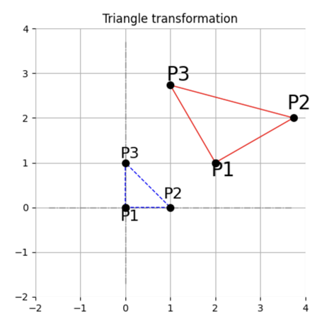

# GraphicEngine2D

**GraphicEngine2D** — це бібліотека для створення 2D графіки з використанням мови програмування Python.

## Можливості

- Зображення векторів та відрізків на площині.
- Зображення точок на площині.
- Зображення полігонів.
- Налаштування відображення фігур, що зображуються (кольори, товщина та стиль ліній тощо).
- Трансформації двовимірних обʼєктів (розтяг, обертання, перенесення).





## Встановлення

1. Клонуйте репозиторій:
   ```bash
   git clone https://github.com/krenevych/GraphicEngine2D.git
   cd GraphicEngine2D
   ```
2. Відкрийте репозиторій будь-якою IDE (проект створювався у Pycharm).
3. Встановіть додаткові модулі для роботи з математичними бібліотеками та бібліотеками візуалізації
   ```bash
   pip install numpy scipy matplotlib
   ```
4. Запустіть файл main.py на виконання, щоб переконатися, що середовище налаштоване правильно.

## Використання

1. Файл main.py містить приклад використання рушія.
2. Опишіть функцію, у якій розмістіть всі обʼєкти, що мають бути на сцені.

```python

def scene():
    polygon = Polygon()

    # Задаємо геометрію - пара послідовних значень визначає вершину на площині
    polygon.set_geometry(
        0, 0,
        2, 0,
        2, 1,
        1, 2,
        0, 1
    )

    # Задаємо параметри полігону
    polygon["color"] = "blue"         # колір ліній
    polygon["line_style"] = "--"      # стиль ліній
    polygon["vertices_show"] = True   # показувати вершини
    polygon["vertex_color"] = "grey"  # колір вершин
    polygon["labels"] = [             # підписи верших зі зміщеннями
        (r'$P_1$', (-0.2, -0.6)),
        (r'$P_2$', (0.2, -0.2)),
        (r'$P_3$', (-0.1, 0.2)),
        (r"$P_4$", (-0.2, 0.3)),
        (r"$P_5$",(-0.7, -0.2)),
    ]

    # задаємо трансформацію
    polygon.scale(2, 1)          # масштабування
    polygon.rotation(np.radians(45))    # поворот
    polygon.translation(2, 1)    # перенесення

    # малюємо полігон
    polygon.draw()

```

3. Відобразіть сцену на екрані використовуючи функцію draw_scene вказавши необхідні параметри відображення:

```python

if __name__ == '__main__':
    draw_scene(
        scene=scene,  # функція у якій описується сцена
        image_size=(5, 5),  # розмір зображення: 1 - 100 пікселів
        coordinate_rect=(-1, -1, 2, 2),  # розмірність системи координат
        title="Picture",  # заголовок рисунка
        grid_show=False,  # чи показувати координатну сітку
        base_axis_show=False,  # чи показувати базові осі зображення
        axis_show=True,  # чи показувати осі координат
        axis_color="red",  # колір осей координат
        axis_line_style="-."  # стиль ліній осей координат
    )

```

- scene: Функція, що описує геометрію сцени.
- coordinate_rect: Розмір системи координат у форматі (x_min, y_min, x_max, y_max).
- grid_show: Увімкнення/вимкнення сітки (булеве значення).
- base_axis_show: Увімкнення/вимкнення базових осей (булеве значення).
- axis_show: Увімкнення/вимкнення осей координат.
- axis_color: Колір осей (наприклад, "red", "blue" тощо).
- axis_line_style: Стиль ліній осей (наприклад, "-", "--", "-." тощо).
