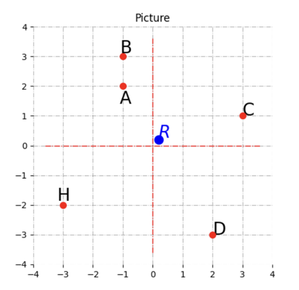
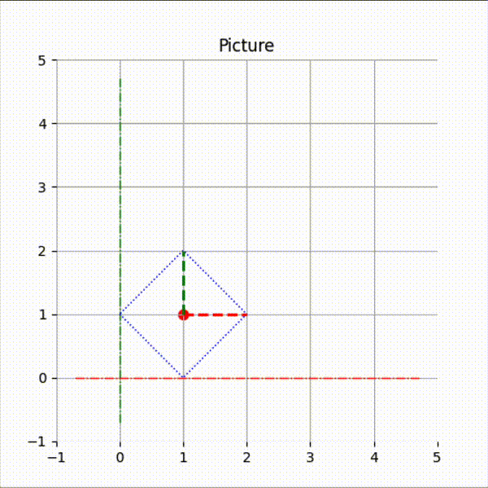

# GraphicEngine2D

**GraphicEngine2D** — це бібліотека для створення 2D графіки з використанням мови програмування Python.

## Можливості

- Зображення векторів та відрізків на площині.
- Зображення точок на площині.
- Зображення полігонів.
- Налаштування відображення фігур, що зображуються (кольори, товщина та стиль ліній тощо).
- Трансформації двовимірних обʼєктів (розтяг, обертання, перенесення).
- Анімації з використанням трансформацій







## Встановлення

1. Клонуйте репозиторій:
   ```bash
   git clone https://github.com/krenevych/GraphicEngine2D.git
   cd GraphicEngine2D
   ```
2. Відкрийте репозиторій будь-якою IDE (проект створювався у Pycharm).
3. Встановіть додаткові модулі для роботи з математичними бібліотеками та бібліотеками візуалізації
   ```bash
   pip install numpy scipy matplotlib
   ```
4. Запустіть файл main.py на виконання, щоб переконатися, що середовище налаштоване правильно.

## Використання

1. Файл [main.py](src/main.py) містить приклад використання рушія для статичних сцен, а
   файл [main_animation.py](src/main_animation.py) відповідно для сцен з анімаціями .
2. Опишіть клас, що є нащадком класу
    - Scene для статичних зображень,
    - AnimatedScene для анімованих.

Цей крок необовʼязковий, просто дозволяє у конструкторі сцени описати обʼєкти, що будуть відображатися.
Проте, можете скористатися відповідним класом Scene або AnimatedScene з подальним додаванням фігур на сцену.


```python

class SampleScene(Scene):

    def __init__(self, **kwargs):
        super().__init__(**kwargs)
        ...  # тут опишіть обʼєкти, та значення їхніх параметрів

```

3. У головній програмі створіть екземпляр описаної сцени

```python

scene = SampleScene(
    image_size=(5, 5),  # розмір зображення: 1 - 100 пікселів
    coordinate_rect=(-1, -1, 6, 6),  # розмірність системи координат
    title="Picture",  # заголовок рисунка
    grid_show=False,  # чи показувати координатну сітку
    base_axis_show=False,  # чи показувати базові осі зображення
    axis_show=True,  # чи показувати осі координат
    axis_color=("red", "green"),  # колір осей координат
    axis_line_style="-."  # стиль ліній осей координат
)

```

- coordinate_rect: Розмір системи координат у форматі (x_min, y_min, x_max, y_max).
- grid_show: Увімкнення/вимкнення сітки (булеве значення).
- base_axis_show: Увімкнення/вимкнення базових осей (булеве значення).
- axis_show: Увімкнення/вимкнення осей координат.
- axis_color: Колір осей (наприклад, "red", "blue" тощо).
- axis_line_style: Стиль ліній осей (наприклад, "-", "--", "-." тощо).

4. Додати фігури на сцену можна використовуючи команду

```python

polygon = Polygon(...)
...
scene["rect"] = polygon  # додати полігон з ключем "rect" на сцену scene

```
ключ фігури - будь-який рядковий ідентифікатор - потрібний, щоб мати доступ до фігури при описі кадрів або онімації.

5. для відображення сцени скористайтеся командою:

```python
scene.show()
```

6. Для анімованої сцени створіть одну чи кілька анімацій для кожної з яких задайте кінцеве значення трансформації,
   кількість та частоту кадрів, чи повторювати анімацію циклічно та задайте спостерігача для нотифікації про події
   анімації

```python

translation = TranslationAnimation(  # створюємо анімацію переміщення
    end=vertex(1, 1),  # значення точки у яку треба перемітити
    channel="rect",  # ідентифікатор фігури до якої має застосовуватися анімація
    frames=20,  # кількість кадрів анімації
)
```

- end - кінцеве значення трансформації
- repeat - чи повторювати анімацію циклічно - значення за промовчанням `False`
- frame - кількість кадрів анімації - значення за промовчанням `100`
- interval - час в мілісекундах між кадрами анімації - значення за промовчанням `16`, що відповідає `1/60` секунди (
  FPS=60)
- animation_listener - екземпляр нащадку класу `AnimationListener` - спостерігач, що реагує на зміни стану анімації

```python

class AnimListenerAllEvent(AnimationListener):

    def on_start(self):  # реація на початок анімації
        print("Started animation")

    def on_repeat(self):  # реакція на початок наступного циклу анімації, при циклічній анімації
        print("Animation repeat")

    def on_finish(self):  # реакція на завершення анімації
        print("Finished animation")


animation_listener = AnimListenerAllEvent()

```

7. Додайте анімацію на сцену

```python
scene.add_animation(translation)
```

9. Запустіть програвання анімації чи серії анімацій командою

```python
scene.show()
```